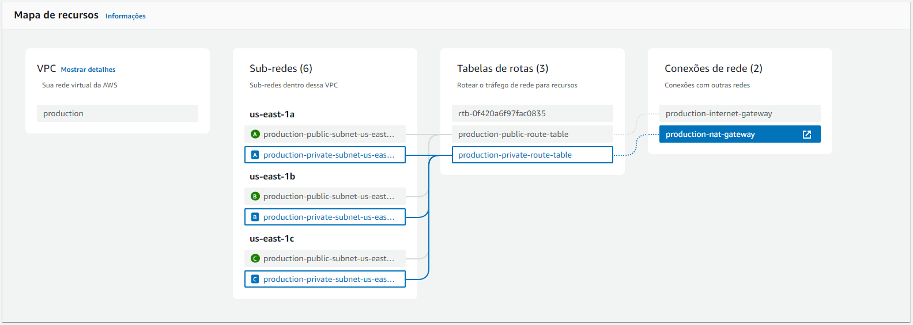
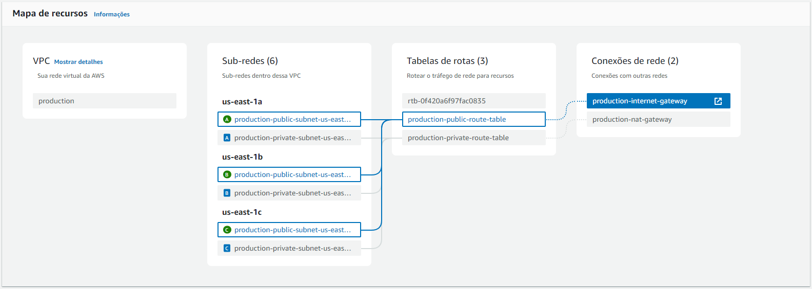

# Terraform AWS Infrastructure

This repository contains Terraform configurations for deploying a basic AWS infrastructure, including a Virtual Private Cloud (VPC), public and private subnets, an Internet Gateway, a NAT Gateway, and associated routing tables and security groups.

## Project Structure

- **`locals.tf`**: Defines local values for tags used across the resources.
- **`provider.tf`**: Configures the AWS provider and sets up the backend for Terraform state management.
- **`tags.tf`**: Calls the `labels` module to apply consistent tags to resources.
- **`variables.tf`**: Defines the variables used across the Terraform configuration.
- **`versions.tf`**: Specifies the required provider version for Terraform.
- **`main.tf`**: Contains the main Terraform resources, including VPC, subnets, gateways, and route tables.

## Variables

The following variables are defined in `variables.tf`:

- **AWS Tags:**
  - `owner_team`: (Default: `"platform"`) The team responsible for the resources.
  - `cost_center`: (Default: `"infrastructure"`) The cost center for the resources.
  - `repository`: (Default: `"https://github.com/allanmoraes/terraform"`) The repository URL.

- **AWS Configuration:**
  - `aws_region`: (Default: `"us-east-1"`) The AWS region.
  - `aws_az`: (Default: `["us-east-1a", "us-east-1b", "us-east-1c"]`) The availability zones.

- **VPC Configuration:**
  - `vpc_cidr`: (Default: `"10.0.0.0/16"`) The CIDR block for the VPC.

- **Subnet Configuration:**
  - `public_subnet_cidrs`: (Default: `["10.0.1.0/24", "10.0.2.0/24", "10.0.3.0/24"]`) The CIDR blocks for public subnets.
  - `private_subnet_cidrs`: (Default: `["10.0.4.0/24", "10.0.5.0/24", "10.0.6.0/24"]`) The CIDR blocks for private subnets.

## Providers

This configuration uses the AWS provider:

- **Source**: `hashicorp/aws`
- **Version**: `~> 5.0`

### Backend Configuration

The Terraform state is managed using an S3 bucket, which is specified in `provider.tf`:

- **Backend Type**: `s3`
- **Bucket**: `tf-state-service`
- **Key**: `infrastructure/network/terraform.tfstate`
- **Encrypt**: `true` (encryption enabled for state file)
- **Region**: `us-east-1`

## Resources

The `main.tf` file includes the following resources:

- **VPC**: A Virtual Private Cloud with the specified CIDR block.
- **Internet Gateway**: An Internet Gateway attached to the VPC.
- **NAT Gateway**: A NAT Gateway with an associated Elastic IP.
- **Subnets**: Public and private subnets across the specified availability zones.
- **Route Tables**: Public and private route tables with appropriate routes.
- **Security Group**: A default security group allowing traffic within the VPC.

### Private Network Map

### Public Network Map


## Setup and Usage

### 1. Generate AWS Access Keys
You need to generate AWS access keys to allow Terraform to authenticate with AWS:

1. Go to the AWS Management Console and navigate to IAM (Identity and Access Management).
2. Create a new IAM user with administrator access and attach the necessary policies. Save the Access Key ID and Secret Access Key.
3. Configure AWS Credentials
    - 3.1 Set up your AWS credentials. You can either configure them in ~/.aws/credentials

### 2. Create and Configure the S3 Backend

Before applying the Terraform configuration, ensure you have an S3 bucket created to store the Terraform state file. Follow these steps:

Create an S3 bucket in the AWS Management Console or using the AWS CLI:

   ```bash
   aws s3 mb s3://tf-state-service --region us-east-1
   ```

### 3. Initialize Terraform
Initialize the Terraform configuration to set up the backend and download required providers:

   ```bash
   terraform init
   ```

### 4. Create and Manage Terraform Workspaces:
Workspaces allow you to manage multiple environments (e.g., development, staging, production). Create a new workspace or switch to an existing one:
```bash
terraform workspace new <workspace-name>
```

To list available workspaces:
```bash
terraform workspace list
```

To switch between workspaces:
```bash
terraform workspace select <workspace-name>
```

### 5. Plan the Deployment
Generate an execution plan to see what changes Terraform will make:
```bash
terraform plan
```

### 6. Apply the Configuration
Apply the Terraform configuration to create or update the resources
```bash
terraform apply
```

### 7.  Destroy the Infrastructure
If you want to tear down the infrastructure, use:
```bash
terraform destroy
```